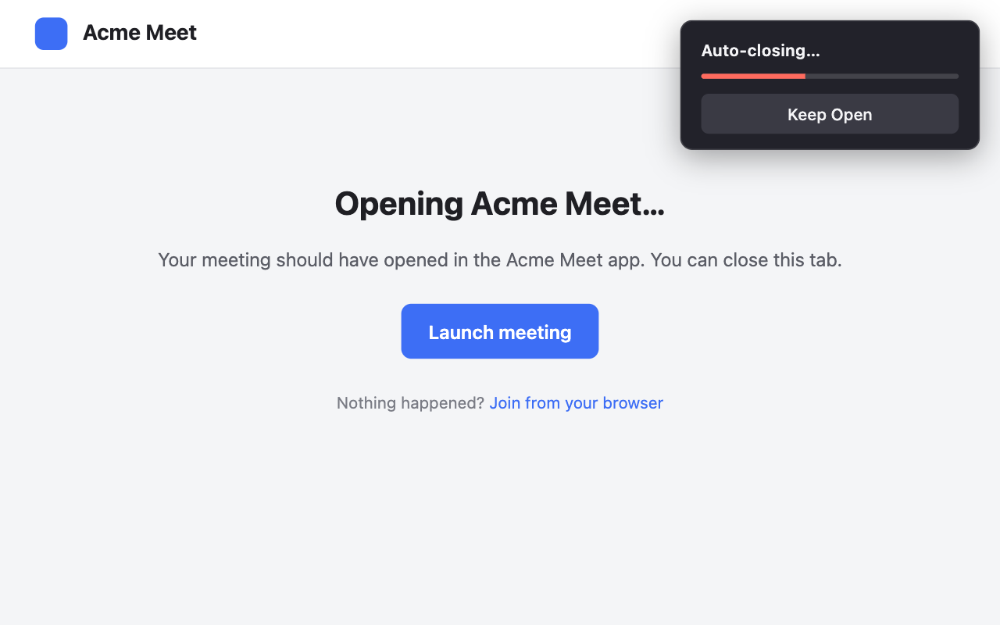
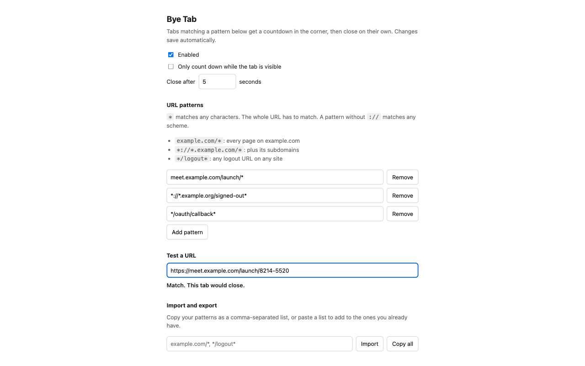

<p align="center">
  
</p>

<h1 align="center">Bye Tab</h1>

<p align="center">
  Automatically close tabs you don't need, with a countdown you can cancel.
</p>

<p align="center">
  <a href="https://chromewebstore.google.com/detail/bye-tab/EXTENSION_ID">Chrome Web Store</a>
  ·
  <a href="https://addons.mozilla.org/firefox/addon/bye-tab/">Firefox Add-ons</a>
</p>



Meeting launch pages, sign-in redirects and "you can close this window" screens tend to
stick around long after they're useful. Give Bye Tab a few URL patterns and it closes
those tabs for you.

When a matching page loads, a small card appears in the top right corner and a bar
fills over a few seconds. Once it's full, the tab closes. To stay on the page, click
**Keep Open** and that tab is left alone until you close it.

## Install

- **Chrome**: [Chrome Web Store](https://chromewebstore.google.com/detail/bye-tab/EXTENSION_ID)
- **Firefox**: [Firefox Add-ons](https://addons.mozilla.org/firefox/addon/bye-tab/)

## Settings



Click the Bye Tab button in your toolbar to open the settings.

- **Enabled** turns everything on or off.
- **Only count down while the tab is visible** makes background tabs wait until you
  switch to them. It's off by default, so tabs opened in the background close without
  getting in your way.
- **Close after** sets how long the countdown lasts.
- **URL patterns** decide which tabs close. Use `*` to match anything. A pattern has to
  match the whole URL, and one without `://` works for both http and https. A `*` in the
  domain stays within the domain, so `*.example.com/*` won't close a page on another site
  that just links to example.com.
- **Test a URL** shows whether a URL would match.
- **Import and export** copies your patterns as a comma-separated list. Paste a list
  into the import box to add those patterns to yours.

Changes save as you make them.

### Pattern examples

| Pattern | Closes |
| --- | --- |
| `example.com/*` | Every page on example.com |
| `*://*.example.com/*` | Every page on its subdomains |
| `meet.example.com/launch/*` | Meeting launch pages |
| `*/oauth/callback*` | Sign-in callback pages on any site |

## Privacy

Bye Tab doesn't collect or send any data. Your settings are saved in your browser and
sync to your browser account if you have sync on. URLs are checked against your
patterns locally.

## Troubleshooting

**Nothing happens in Firefox.** Firefox lets you decline site access when installing.
Go to `about:addons`, open Bye Tab, and under **Permissions** turn on
**Access your data for all websites**.

**A tab isn't closing.** Paste its URL into **Test a URL** to check your patterns.
Changes apply the next time a page loads.

## Building from source

```
node scripts/build.mjs
```

This creates unpacked extensions in `dist/chrome`, `dist/firefox` and `dist/safari`.
On a Mac with Xcode, it also turns the Safari build into an Xcode project at
`dist/safari-xcode` with `xcrun safari-web-extension-packager`. Open it, choose your
signing team, and run the macOS or iOS app to load the extension in Safari.

To build a single browser, pass its name, for example `node scripts/build.mjs safari`.

### Screenshots

The screenshots above double as the store listing images. To update them:

```
npm install
npx playwright install chromium
npm run screenshots
```

This builds the Chrome extension, loads it in headless Chromium, and saves 1280x800 images
to `screenshots/`, the size the Chrome Web Store and Firefox Add-ons ask for.
